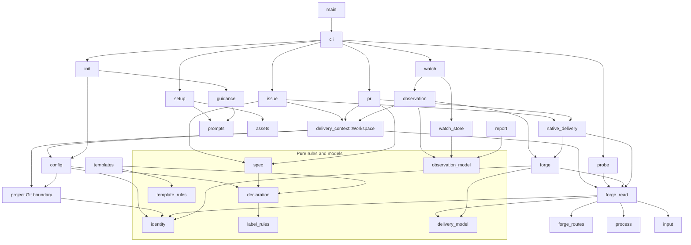

# Runtime architecture

This page defines the runtime module boundaries and the evidence required to
change them. An arrow in the diagram means “depends on”. The diagram is the
target module DAG. The architecture test and CI determine whether the source
conforms to it.

## Ownership and authority

| Area | Owner | Boundary |
| --- | --- | --- |
| Declaration | `declaration` | Parses and validates `.specgit.yaml`. It owns schema rules, not file access or Git lookup. |
| Repository identity | `identity` | Defines repository, host, and object-ID rules. It does not call Git or a forge. |
| Local project state | `config`, `project`, `selection` | Reads project configuration and Git context. State belongs to the repository or its Git metadata. |
| Agent integration | `setup`, `guidance`, `prompts`, `assets` | Builds and writes project-scoped skills, marked instruction blocks, host hook entries, and ownership receipts. It does not install global host state or a project executable. |
| Native platform | `forge_read`, `forge_routes`, `forge`, `native_delivery` | Separates read transport, route construction, response decoding, and explicit mutation. The forge owns CI, protection, review, and merge. |
| Observation | `observation_model`, `watch_store`, `watch`, `observation`, `report` | Stores scoped event facts and presents them. An observation is not authorization or proof of completion. |
| Command line | `cli`, `main` | Parses and dispatches commands, then formats output. `main` is only the process entry point. |
| Delivery context | `delivery_context::Workspace` | Loads and rechecks Git, declaration, and native project identity. It does not own Issue or PR write transactions. |

The local runtime can enforce only the checks that it owns. Host hooks and Git
hooks must be installed to run. Hook context can fail open when input is
unsupported or local identity is unavailable. Git guard checks apply when the
installed hook runs. Neither path is a universal sandbox for file edits.

Native writes require existing user authorization. A declaration and a
`--dry-run` result grant no permission. GitHub or GitLab decides whether CI,
review, protection, and merge conditions pass. SpecGit must read back native
state before it reports delivery completion.

## Module dependency DAG

The graph shows the key module dependencies. An arrow means “depends on”. The
architecture test checks the complete Rust source dependency graph and its
layer rules.



The intended boundaries are:

- `declaration` owns schema and validation rules. `identity` owns repository,
  host, and object-ID rules. `label_rules` and `template_rules` own vocabulary.
- `config` is the local read and routing facade. It may keep compatibility
  aliases. Pure rules stay in their owner modules.
- `project` owns Git process interaction. Its identity re-exports preserve
  existing callers; they must not copy the identity implementation.
- `forge_read` is read-only. It exposes `get` for resource reads and fixed
  GraphQL operations for complete closing references. It does not expose
  mutation methods.
- `forge_routes` builds API paths. `forge` decodes platform responses.
  `probe` measures supported capabilities. `native_delivery` owns explicit
  native writes.
- `issue` and `pr` keep their preparation, review, and write steps private.
  Their `Workspace` loads and rechecks project identity. Each write flow owns
  its transaction, journal, and locking behavior.
- `observation_model` contains fact classification. `watch_store` and
  `report` depend on that model, not on the `observation` use case.
- `cli` separates argument parsing, host behavior, dispatch, inspection, and
  output. `main` only starts the CLI.
- `prompts` embeds short English and Chinese guidance and host entry points.
  `runtime/assets/SKILL.md` remains the full operational guide. Keep the
  generated guidance short. Do not copy the full workflow into each host file.

These edges describe the intended design. Do not treat this page alone as
evidence that an unfinished extraction or test has passed.

## Assets, rollback, and notices

Setup owns only the project files and hook entries recorded in its private
Git-metadata receipt. Guidance owns only its marked block and its separate
receipt. The local Git guard owns only its recorded hook blocks. Keep these
receipts separate because the features have different install paths and
rollback lifecycles.

Refresh and uninstall must validate the recorded content before changing it.
An edited or ambiguous owned asset is preserved for reconciliation. Foreign
instruction text, hook entries, and shell-hook content must remain intact.
Rollback restores a recorded transaction in its original Git metadata scope.
It must not widen asset ownership or move state to a global directory.

Observation notices describe evidence at a recorded time. A notice is not a
fresh read. Refresh native evidence before acting on it. Acknowledging an exact
event ID records receipt; it does not prove that a person read the notice or
that delivery is complete. Only native readback of the intended merge and all
selected Issue closures establishes completion.

## Maintenance and checks

When a module boundary changes, update this DAG and the architecture contract
in the same change. Keep compatibility APIs as aliases or re-exports when
possible. Do not duplicate rule implementations across modules.

The architecture contract is finite. It requires an acyclic full-source
dependency graph, zero layer violations, read-only forge access limited to
`GET` and fixed closing-reference GraphQL operations, and passing public API
compatibility checks. Release qualification must also pass on Linux x64,
macOS arm64, and Windows x64. These checks do not claim that all technical debt
is absent.

For documentation-only edits, review this page and run:

```sh
node scripts/ci-metadata-check.mjs
```

For module or runtime changes, use the pinned Rust checks and the applicable
native CI matrix in [CI scope](ci-scope.md). A diagram or a local compile does
not replace the complete-source architecture test or three-platform CI.
