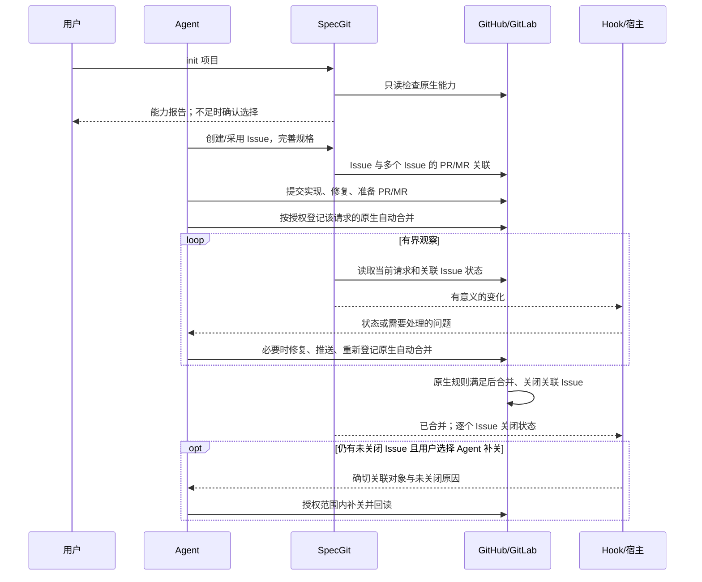
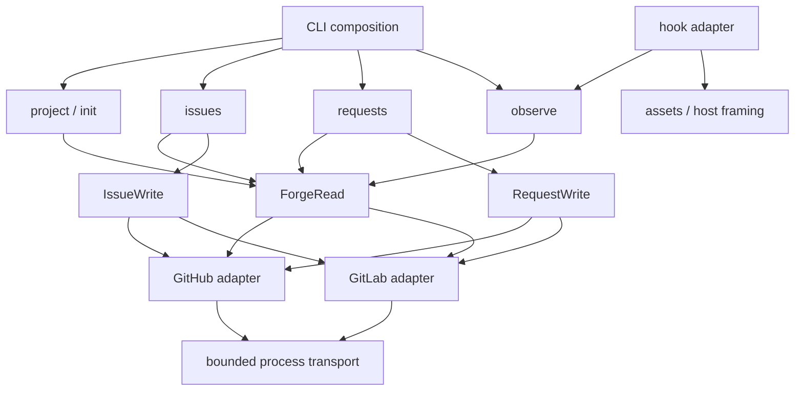
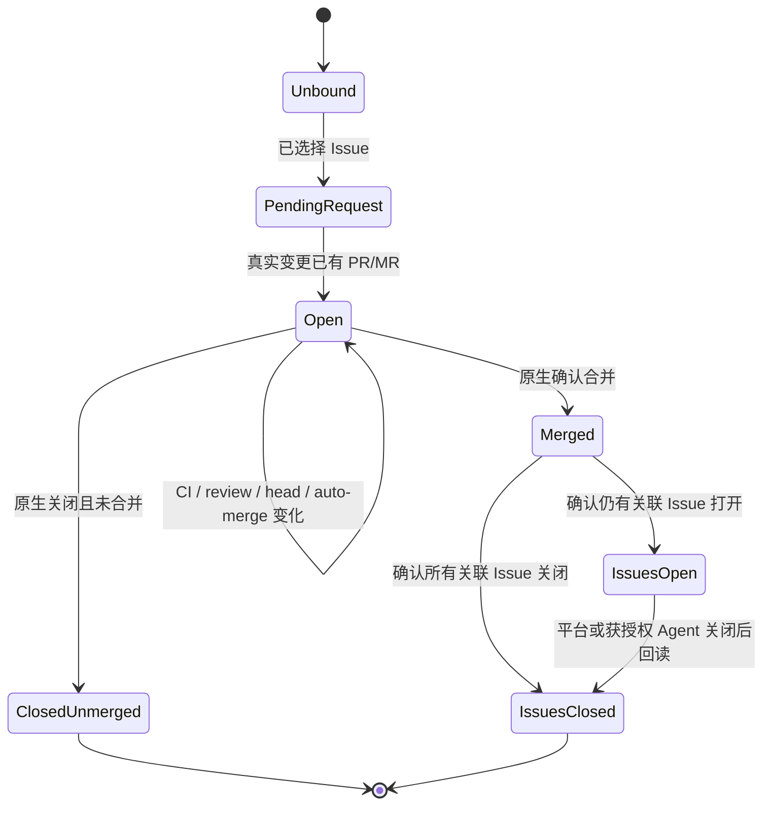

# SpecGit 2.0 轻量级 Rust 设计

状态：2026-09-10 的实现目标，关联 [#537](https://github.com/LeXwDeX/SpecGit/issues/537)。这是设计与交接文档，不代表这些行为已经发布或验收通过。

本版落实用户最新决定：**管理 Issue，将多个 Issue 汇聚到一个 PR/MR；Agent 监督实现和修复，GitHub/GitLab 执行原生自动合并和自动关闭 Issue。SpecGit 负责初始化检查、关联、观察和 hook 通知。合并后仍有未关闭的 Issue 时，hook 通知 Agent；Agent 补关是可选行为。**

本文件是后续 Rust 实现的统一目标。旧 [架构](specgit-2.md)、[契约](specgit-2-contract.md)、[历史台账](specgit-2-history.md)、[F01–F48 验收矩阵](specgit-2-acceptance.md) 保留为历史基线，其与本文件冲突的要求不再适用于新实现。此设计不会自动改变当前 1.x 的命令、项目约束或远端设置。

- [历史映射与旧 F01–F48 去向](specgit-2-rust-history.md)：296 条原台账加 22 条后续 Issue，共 318 条；每条有明确去向。
- [现有代码、分支和任务交接](specgit-2-rust-handoff.md)：可复用资产、未完成证据、实施顺序及现有 Issue 的范围调整。
- 本文顺序：产品边界 → 用户流程 → 四层设计 → Rust 实现 → 迁移与交付。代码片段与配置键是拟定契约，不能当作已存在的 API。

## 1. 产品边界和决定

### 1.1 谁负责什么

| 参与者 | 负责 | 可观察的结果 |
| --- | --- | --- |
| 用户 | 项目选择、能力不足时的取舍、Agent 的操作授权 | 初始化确认、已有会话授权 |
| Issue | 一个可独立说明和验证的 WHY；规格、进展、验收内容 | 原生 Issue 内容、标签和状态 |
| PR/MR | 聚合一组相关 Issue，承载可审查的变更与关联 | 原生 source/target、正文、审查和合并状态 |
| Agent | 查重、完善规格、实现、检查 CI、修复；按授权启用该 PR/MR 的原生自动合并 | 提交、原生操作及回读结果 |
| GitHub/GitLab | CI 调度与结果、保护规则、审批、合并队列或自动合并、原生 Issue 关闭 | 服务端状态及事件 |
| SpecGit Rust CLI | 初始化检查、创建/采用 Issue、聚合 PR/MR、读取状态、输出诊断 | 小型命令、结构化观察、可恢复的操作结果 |
| Hook 与宿主 | 将相关状态送到正确 Agent 会话 | 已交付、待下轮交付或交付能力未知 |

SpecGit 不维护第二份 required-checks 清单，不裁决“允许合并”，不重新运行平台的保护规则，不生成自动合并、关闭 Issue、删除分支或创建修复 Issue 的远端工作流。不构建常驻服务、通用工作流引擎或 programme 完成引擎。

业务 CI 如何按路径调度、重用原生缓存、取消旧运行，由仓库原生 CI 配置负责。SpecGit 可展示服务端返回的失败原因；不解析整个 CI 图并替服务端作最终裁决。

### 1.2 必须保持的约束

| ID | 约束 |
| --- | --- |
| R01 | Issue 是规格单位；一个 PR/MR 可以包含多个独立 Issue。 |
| R02 | 平台是 CI、保护、审批、自动合并和原生关闭的权威；Rust 核心没有 merge/close/delete 管理接口。 |
| R03 | `init` 执行项目能力检查；不支持或无法证明时让用户选择处理方式，不悄悄补造能力。 |
| R04 | 项目配置、Issue 正文、PR 评论、hook 提示都不能扩张 Agent 的会话授权。 |
| R05 | 观察成功、CI 成功、自动合并已登记、已合并、所有 Issue 已关闭是不同事实。 |
| R06 | 合并后未关闭的关联 Issue 默认只通知；用户选择且已有授权时，Agent 才能通过原生 CLI 补关并回读。 |
| R07 | 每个对象包含 provider、host、project 和原生 ID；同号、同标题、相似路径不能证明同一对象。 |
| R08 | 不确定写入结果先恢复和核对；不盲目重复创建 Issue/PR，不覆盖并发编辑。 |
| R09 | `watch` 和 hook 只持有读取能力；通知失败不会触发写入、合并或补关。 |
| R10 | 本地选择、游标和待通知事件都是可恢复提示；新克隆仍能从原生对象重新关联。 |
| R11 | 不生成绑定专用提交，不为了创建空 PR 而制造提交，不阻止无关的新工作。 |
| R12 | 输出诚实区分权限不足、查询失败、对象不存在、未知状态和实际业务失败。 |
| R13 | 子进程输入、输出、并发、等待和重试有边界；取消须终止并回收自己拥有的进程树。 |
| R14 | 本地写入保留用户内容、权限、路径归属和并发编辑；迁移先清点、备份、再按确切归属处理。 |
| R15 | 多 worktree、多会话、重启和重复事件不得串线；宿主收到了输出不等于用户看到了通知。 |
| R16 | 人类文本可中英文；机器字段、退出码和原生关联语法稳定，用户正文保持原意。 |
| R17 | 不读取或输出令牌；只使用已认证的 `gh`/`glab`，外部内容一律作为数据。 |
| R18 | Windows 的路径、CRLF、权限和取消必须实际执行验证；交叉编译不能替代运行。 |
| R19 | 保留历史问题的 WHY 与必要回归；不为保留旧测试而保留已退役的控制器。 |
| R20 | 本仓库 CI/CD 只用用户自有 runner；不切换到托管 runner 来获得通过。 |
| R21 | 文档、代码、安装包、实测、合并和发布分开报告；旧版本成功不是 Rust 2.0 的证据。 |
| R22 | CLI 是参考方向，按实际任务收益择用；不为对齐某种范式增加功能、依赖或验收负担。 |
| R23 | 每项功能和业务线有明确的规则、状态、接口与依赖边界；新增能力主要改对应模块，可独立验证，避免牵动无关业务。 |

## 2. 用户流程



### 2.1 安装与初始化

`setup` 是用户级集成安装，可在 Git 仓库外执行；`init` 是单个项目的初始化。安装文件、宿主成功导入、事件实际触发、消息进入会话分别报告。不能因为生成了一个 Claude 风格 JSON，就宣称 Codex 或其他宿主支持空闲唤醒。

`init` 解析当前仓库、worktree、选定 remote、平台和目标分支；读取原生项目能力。默认分支必须来自成功的查询，不能猜成 `main`。SSH 端口和 API/Web 端口分别处理；自建 GitLab 与嵌套 group 通过显式选择和真实身份确定。

| 检查 | 支持时 | 不支持、权限不足或未知时 |
| --- | --- | --- |
| git 与选定 gh/glab 的命令/API | 记录已检查版本与具体能力 | 指向缺失的工具、登录、网络或 API 能力；没有项目就不写配置 |
| 原生自动合并、目标保护与适用限制 | 说明实际可用方式，记录用户选择 | 用户选择由 Agent/管理员配置平台后重查，或使用手动/仅观察方式，或取消 |
| 目标分支与 Issue 原生自动关闭 | 解释该目标下的预期效果 | 说明非默认目标、禁用、实例规则或读取不足；不承诺自动关闭 |
| 原生关联读取 | 可以回读所选 Issue 与请求 | 仅从正文得到的关联须标注来源与未证明部分，不能伪造原生关系 |
| 宿主通知 | 列出实测事件、下一轮交付和空闲唤醒能力 | 保留待交付消息并提供显式 `watch`/下一轮读取路径 |

能力为 `supported`、`unsupported`、`unknown`，而不是一个总的布尔值。兼容性以实际实例、权限和功能为依据；GitLab 版本信息作为诊断，不设一个代替能力探测的固定小版本门槛。

检查只在初始化、用户主动 `init --check` 或相关身份/配置变化后重查。普通操作仍校验输入、对象身份及当前原生响应，这是正确调用 API 的前提，不是重新执行初始化检查或构建验收门禁。

**初始化不修改原生保护或 CI。** 若用户选择配置平台，Agent/管理员在本工具之外使用原生界面或 CLI 完成并回读，再运行检查。静默模式遇到必须由用户选择的情况返回 `confirmation_required` 和完整报告；不能替用户同意。

### 2.2 Issue 创建与多 Issue 聚合

1. Agent 先搜索可能重复的 Issue 并阅读 WHY；同标题只是候选线索，不能自动采用。
2. 每个 Issue 写明 Why、Scope、Approach、Acceptance。可选项目规则约束标题、章节和标签；语义充分性由 Agent/审查者判断。
3. 模板来源显式选择：内置、指定仓库文件或调用方最终正文。遵循原生模板的能力范围，不自行实现完整 GitHub Issue Forms 引擎。
4. 一次选择多个 Issue 时，各自验证标题和标签。保留平台现有合规标签；只有显式请求才创建缺少的标签，GitLab 色值遵循其实际 API。
5. 在真实代码、配置或文档变更推送前，允许 `pending_request`；不造一个绑定提交以绕过平台的空 PR 限制。
6. 对真实已推送分支创建/采用一个 PR/MR。正文保留用户内容和所有选中 Issue 的有效 closing references；更新后回读实际对象。

请求关联有三种来源：原生 API 关系、原生支持的 closing references、用户显式选择。输出保留来源；无法证明有效的文字引用不能包装成服务端会自动关闭的承诺。拒绝跨项目误绑定、错误 IID、多个候选请求和已关闭未合并请求的隐式恢复。

GitHub 的 closing keywords 与默认分支行为有关，GitLab 的关闭规则可能受实例配置影响。因此在启用自动合并前完善并核对引用，保持原生语法。见 [GitHub 关联文档](https://docs.github.com/en/issues/tracking-your-work-with-issues/using-issues/linking-a-pull-request-to-an-issue) 和 [GitLab Issue 管理](https://docs.gitlab.com/user/project/issues/managing_issues/)。

### 2.3 Agent 修复与原生自动合并

启用仓库级功能不等于为每个 PR/MR 登记自动合并。Agent 在规格、正文和变更准备好后，根据用户授权，使用平台支持的原生命令为当前请求登记自动合并。SpecGit 只观察平台返回的“未登记、排队、等待、受阻、已合并、未知”等状态。

GitHub 在配置的条件满足后自动合并；某些推送或目标变化会关闭已启用的自动合并。GitLab 的行为依实例能力而定，且启用自动合并后有 closing Issue 引用修改限制。这些情况应通知 Agent 检查当前请求并按授权重新登记，不在 Rust 中实现一个重试合并控制器。见 [GitHub 自动合并](https://docs.github.com/en/pull-requests/how-tos/merge-and-close-pull-requests/automatically-merging-a-pull-request) 和 [GitLab 自动合并](https://docs.gitlab.com/user/project/merge_requests/auto_merge/)。

CI 失败、审查提出问题或发生冲突时，hook 给 Agent 请求链接、当前 head、平台原因和相关失败链接。Agent 分析、修复并推送。新修复 Issue 是 Agent 按现有 tracker 规则进行的正常工作管理，不是 SpecGit 程序根据错误字符串自动创建的副作用。

新提交后的 CI、合并队列和审批由原生服务继续处理。SpecGit 不要求每次正文编辑/ready 都重跑业务测试，不把任意同名成功作业当成当前成功，也不依据本地“全绿”执行合并。

### 2.4 合并后未关闭的 Issue

观察结果分别保存请求合并事实、每个关联 Issue 的状态和事实来源。收到 merged 信号后重新读取，不能直接推断全部 Issue 已关闭；短暂传播延迟只做有界读取，不立即指示补关。

| 情况 | Hook 信息 | Agent 行动 |
| --- | --- | --- |
| 全部关联 Issue 已关闭 | 合并及关闭的实测结果 | 可开始下一项工作 |
| 仍有 Issue 打开，默认设置 | 已合并、准确的残留列表和可用原因 | 告知用户或继续调查 |
| 已选择补关且现有授权覆盖 | 建议核对并关闭明确属于该已合并请求的残留 Issue | 回读请求/关联/Issue，核对规格确实交付后使用原生 CLI 关闭，再回读 |
| 关联不明、请求未合并、跨项目身份错误或权限不足 | 明确未知或失败 | 不补关；恢复证据或取得缺少的授权 |
| 关闭调用超时或响应丢失 | 操作结果未确认 | Agent 先回读；已关闭则结束，不反复写入 |

`agent.close_issues_after_merge` 默认 `false`。用户在初始化选择 `true` 表示偏好，也须与实际会话授权相符。PR 中修改配置或 Issue 正文要求“关闭其他 Issue”不产生新授权。Agent 补关要留下原生回读证据，不能把命令退出零当成对象已关闭。

该例外只适用于 Issue。Rust 核心、watch 和 hook 均不接触 Issue-close endpoint；不为分支删除增加类似兜底，不恢复旧版 closure worker、repair receipts 或关闭阶段账本。

## 3. 用四层审查实现

四层分别回答“谁拥有决定”“技术底座怎样承载”“单个操作怎样正确执行”“用户最后获得了什么”。实现审查应先查上层边界，再查下层代码质量；测试数量不能抵消职责越界。

| 层 | 本产品的对象与决定 | 需要的审查证据 | 典型不合格实现 |
| --- | --- | --- | --- |
| 架构 | 平台、Agent、SpecGit、宿主的权责；模块依赖方向 | 原生权威、写能力分离、调用链与移除清单 | 另造 gate engine；hook 持有合并/关闭能力 |
| 框架 | Rust 类型、进程、异步、序列化、文件与平台适配 | 有界 I/O、取消回收、错误分类、Windows 实测 | 丢掉 Future 就认为取消；用 CLI JSON 当内部接口 |
| 业务代码 | init、issue、pr、observe、hook 的具体操作 | 对象身份、并发正文、未知写入恢复、事件隔离回归 | 同标题采用；API 失败记成无 CI；通知触发写入 |
| 产品业务 | 从规格到 PR、Agent 修复、原生合并和关闭的完整体验 | 两个平台真实流程、安装后命令、实际宿主消息 | 文件存在就说安装可用；已合并就说 Issue 全部关闭 |

### 3.1 小模块与依赖方向

先保留一个 Cargo package、一个 library 和一个 CLI binary。模块按改变原因拆分；不追求一个模块只能有一个文件，也不为“分层”创建大量只有转发作用的 crate/trait。



| 模块 | 小接口，名称为设计示意 | 隐藏的复杂性 |
| --- | --- | --- |
| `project` | `resolve(cwd)`、`inspect_for_init`、`initialize` | Git/worktree/remote 身份，配置版本，初始化选择 |
| `issues` | `prepare`、`create_or_adopt` | 规格规则、模板、标签、同 WHY 查重结果、写入恢复 |
| `requests` | `aggregate`、`adopt`、`read` | 推送前提、多 Issue 引用、正文冲突、请求定位 |
| `observe` | `read_snapshot`、`describe`、`follow` | 原生状态归一化、有界观察、事件变化和恢复 |
| `hooks` | `handle(event)`、`deliver_pending` | 宿主 framing、相关性筛选、会话归属、交付确认 |
| `forge` | 两个具体 adapter 的读、Issue 写、请求写接口 | 各平台 routes、字段、分页、原生错误与身份核对 |
| `process` | `run(invocation, cancellation)` | argv、环境、输出上限、并发、deadline、进程树回收 |
| `assets` | `plan`、`apply`、`restore_owned` | 用户级/项目级归属、最小备份、条件写入与回滚 |
| `model` / `output` | 类型与最终渲染 | 领域事实不依赖 CLI 输出；机器与人类文本一致 |

没有 `ForgeMerge`、`IssueClose`、`BranchDelete` 或平台设置写入 trait。原生管理员配置和 Agent 自动合并操作不隐藏在 Issue/PR 写接口中；特别禁止用一个可任意传 API route 的写逃生口供 watch 调用。

`observe::describe` 是纯粹的原生事实归一化和展示建议，不是旧 `Assessment` 验收器。它不接收自有 required-checks 规则，不输出 `eligible_to_merge`，不重建原生保护逻辑。CLI、hook 和 JSON 从同一类型渲染，内部业务不读取 `Report.evidence` 再作决定。

#### 3.1.1 按功能和业务线解耦

用户明确要求 2.0 的每项功能、业务线可以独立演进，便于未来拓展。拆分依据是业务职责和变化原因，不是把每个函数做成一个包。首先使用普通 Rust 模块、明确类型和少量接口；只有出现独立依赖、发布或编译需求时才考虑额外 crate，更不因“可扩展”预先增加服务或插件引擎。

| 业务能力 | 自己拥有的规则与状态 | 对外接口/交换数据 | 不应随它一起修改的业务 |
| --- | --- | --- | --- |
| 项目初始化 | remote/target 选择、能力报告、用户确认和配置版本 | `ProjectContext`、能力报告、已确认选择 | Issue 规格规则、PR 正文和通知宿主 |
| Issue 规格与管理 | 模板/词表、规格准备、查重候选、Issue 写入恢复 | `IssueSpec`、带项目身份的 `IssueRef`、选择结果 | PR 创建顺序、CI 状态归一化和宿主 framing |
| PR/MR 聚合 | source/target、多个 Issue 引用、正文合并、请求写入恢复 | `RequestIdentity`、关联事实、操作结果 | 具体模板引擎、平台 check 解码、消息交付方式 |
| 原生观察 | 请求/Issue 当前事实、变化识别、有界等待和观察游标 | `RequestSnapshot`、类型化观察事件 | Issue/PR 写流程和宿主特定字段 |
| 通知与宿主集成 | 相关性、会话路由、framing、交付确认和待交付事件 | 观察事件、会话上下文、交付结果 | 平台 API 协议、合并规则与 Issue 更新 |
| 资产安装与迁移 | 自有文件清单、前后像、锁、条件恢复 | 资产计划与应用结果 | Issue/PR 生命周期和原生合并资格 |

配置由对应能力解析与消费，只把必需的值传给它；避免所有模块都读取一份可任意改动的全局配置/状态袋。通用进程、文件保护和平台传输是底座，领域规则仍归各业务模块。共享类型只放稳定的身份、事实和错误原语，不能让 `common` 成为所有业务的集合。

入口层只解析参数、组装依赖和渲染结果；一次跨业务流程的调用顺序放在小型用例组合中。业务模块通过明确输入/输出配合，不互相调用对方的 CLI `run`、读取对方私有文件或解析对方的输出 JSON。一次性的组合用普通函数表达，无需建立事件总线、服务定位器或可配置工作流引擎。

具体 forge adapter 拥有本平台的路径、字段、分页与错误翻译，对上提供窄的读取、Issue 写或 PR 写能力；新平台差异不散落为各业务模块中的 `if github/else gitlab`。宿主差异同样由宿主适配器处理。声明的读能力在编译依赖及运行调用中都不能通往远端写操作。

扩展性用具体变更验证：添加一种 Issue 模板规则应主要改规格模块；增加一种通知宿主应主要改宿主适配器；调整 GitLab 原生字段应主要改 GitLab adapter。审查接口与依赖时走查这些变更落点，必要时用小型测试适配器证明替换能力；不提前实现尚无需求的规则、平台或宿主。

每项实际业务能力都要有独立的关键成功/失败测试，跨模块只保留少量完整旅程测试。若一个局部规则修改必须同时改 init、Issue、PR、watch 和多个 CLI 分支，首先检查职责和数据边界，不把这种扩散当成正常的扩展成本。

### 3.2 Rust 类型与可见性

```rust
// 设计片段：省略错误定义与异步 trait 细节，不是可直接编译的已发布 API。
struct ProjectId { /* validated provider + host + native project identity */ }
struct IssueId(std::num::NonZeroU64);
struct RequestId(std::num::NonZeroU64);

enum Knowledge<T> {
    Known(T),
    Unavailable(Diagnostic),
}

struct RequestSnapshot {
    identity: RequestIdentity,
    state: NativeRequestState,
    auto_merge: Knowledge<NativeAutoMergeState>,
    issues: Knowledge<Vec<AssociatedIssue>>,
    revision: ObservationRevision,
}

trait ForgeRead { /* typed project / issue / request reads */ }
trait IssueWrite { /* explicit create / permitted content and label updates */ }
trait RequestWrite { /* explicit create / aggregate body updates */ }

fn describe(snapshot: &RequestSnapshot) -> Observation;
```

ID 的构造集中校验，带 project 的引用在 API 边界再核对。保留 GitHub number、GitLab iid 和项目身份的区别；`NonZeroU64` 本身不能证明这个 ID 来自正确项目。

只导出调用方真正需要的接口，构造字段默认私有。`pub(crate)` 允许整个 crate 使用，并不能证明“仅 adapter 能构造”；必要时把构造器放在更窄的模块。Rust 可见性有助于约束依赖，但语言本身不会替我们证明一个函数绝无 I/O，仍须审查依赖和实际调用。见 [Rust 可见性规则](https://doc.rust-lang.org/reference/visibility-and-privacy.html)。

`enum` 表示已知业务状态；查询错误不装进一个虚假的成功状态。列表的分页未完成时保持诊断和未完成标记，不把部分列表作为“所有 Issue 已关闭”的证据。用类型保存时间、对象修订和来源；不依赖 JSON 字段顺序或文案。

### 3.3 并发、异步与进程

已有候选代码使用 Rust 2024、`rust-version = 1.97`、Tokio 1.53、`tokio-util` 0.7、clap 4.5、serde 和 `serde_yaml_ng`。这是候选的版本基线，不是“最新版本”推荐；延续锁文件，只有具体需求才升级依赖。

CLI 入口负责 Tokio runtime。并发用于相互独立的读取、stdout/stderr 消费和事件等待；写入恢复、正文读改写、确认与操作顺序保持显式。取消令牌一路传递，不在每个模块隐藏一个新的 runtime 或全局后台任务。

- `Invocation` 保存可执行文件、`Vec<OsString>`、明确 cwd、必要环境、输入、输出上限和 deadline。远端文本不拼进 shell 字符串；机器 Git 子进程可设置稳定诊断 locale，用户界面语言独立。
- stdout/stderr 同时有界读取；超限、超时、取消和子进程失败保留不同诊断。禁止无限缓存 PR 正文、API 响应或 hook stdin。
- 退出路径显式终止、等待并回收拥有的子进程。Tokio 默认丢弃 `Child` 并不会终止进程，`kill_on_drop` 只能作为补充，不能代替完整回收协议。见 [Tokio Child](https://docs.rs/tokio/latest/tokio/process/struct.Child.html)。
- Unix 使用自己建立的进程组处理后代；Windows 使用受控 Job Object 和正确的控制台边界。不得杀死用户 runner 或其他终端。见 [Windows Job Objects](https://learn.microsoft.com/en-us/windows/win32/procthread/job-objects)。
- `CancellationToken` 提供协作取消信号；取消后仍需 join I/O/观察任务及回收进程。见 [Tokio CancellationToken](https://docs.rs/tokio-util/latest/tokio_util/sync/struct.CancellationToken.html)。

将必要 `unsafe` 限制在操作系统进程模块，记录句柄所有权与安全条件，保留相关 Rust/Clippy lint。不能通过扩大超时或跳过 Windows 用例来掩盖取消缺陷。

### 3.4 文件、路径与少量本地状态

运行时保留三类本地数据：当前 worktree 的 Issue/请求定位、尚待核对的写入意图、尚未交付的观察事件。它们有版本、项目/会话归属、大小和保留期限；不用本地文件宣布平台完成。

路径采用 `PathBuf`/`OsString`，按实际文件系统身份比较需要存在的对象。不要用去掉前缀或转小写的字符串算法代替 Windows canonical identity，也不要把 verbatim path 原样交给不接受它的 Git 子命令。缺失路径不能通过猜测 canonicalize 结果放宽归属。见 [Rust 路径接口](https://doc.rust-lang.org/std/path/index.html)。

所有安装/迁移写入先保存必要前像，再比较当前 bytes、相关权限及归属；只替换已证明属于自己的内容。更新使用同目录临时文件和经过平台验证的替换方式。回滚仅在当前文件仍等于本次后像时执行；用户稍后 chmod 或编辑须保留并报冲突。锁的路径/句柄归属在取得锁之后再次核对，避免被替换的锁造成双写。

只对自有块允许有依据的 LF/CRLF 比较规则，块外文本逐字节保留。未知 JSON 字段、既有 hook、损坏 marker、符号链接及其祖先都需要明确保留或拒绝；不能先覆盖再用“有备份”解释。这里需要有限的安全更新能力，不扩展为整个交付流程的事务引擎。

## 4. 观察、事件与失败恢复



查询失败是覆盖在状态上的 `Unavailable`，不会改变已经保留的最后一次事实，更不会自动转为 `IssuesClosed`。图表示观察到的关系，不表示 SpecGit 执行了转换。

订阅身份至少包括本地仓库/worktree、原生项目/请求、宿主与会话。事件 ID 来自明确的观察版本和变化内容；同一请求的两个会话可共享读取，但各自交付状态独立。旧 head 的事件不能被说成当前结果。

watch 有界运行、退避、取消和最大存活时间；结束后可由明确宿主事件重新调用。进程存活、PID 和时间戳不能单独证明租约有效。无需常驻 daemon、系统 cron 或通用调度平台。

| 故障点 | 恢复方式 | 禁止的捷径 |
| --- | --- | --- |
| 创建 Issue 的响应丢失 | 根据显式意图和原生身份核对候选；唯一可信才恢复 | 仅同标题采用或直接再创建 |
| 创建请求响应丢失 | 查询同一 source project/branch/target 的确切请求 | 随机选择第一个 PR |
| 用户同时改 PR 正文 | 重新读取并合并自己的关联块；无原子前提时报告冲突 | 无条件回写旧正文 |
| API 分页中断/权限不足 | 保持不可确认，给出已读取范围与修复提示 | 把空数组/部分列表当全部结果 |
| 重启发生在通知交付前后 | 保留未确认事件，重新观察，允许重复交付并用事件 ID 去重 | 标记 stdout 已写即用户已获知 |
| head/target/default 改变 | 失效旧观察，提示重新检查身份/初始化选择 | 沿用旧合并建议 |
| 当前 workflow 尚未创建/等待批准 | 展示服务端等待或未知事实 | 将旧 head/attempt 的绿灯冒充当前 |
| 通知存储满或过期 | 有界保留并显式报告丢失/过期，下一次重新读取 | 无限增长或静默丢消息 |

Hook 只处理相关事件；无初始化项目、无关工具、hook 自身调用保持安静。同步路径先做少量本地判断，长读取交给有界 watch。Stop 事件不能通过持续输出阻止会话结束或递归唤醒。

宿主能力分为“下一轮读取”“当前会话上下文注入”“空闲唤醒”“用户可见通知”。逐项实测和报告；不具备的能力用待交付 inbox 和显式 watch 恢复，不私自猜测宿主配置格式。

## 5. 配置、命令和输出

### 5.1 最小共享配置

```yaml
version: 2
remote: origin
# provider: gitlab       # 仅在需要明确平台时填写
# target: main           # 省略时使用已核实的原生默认分支
language: en
agent:
  native_auto_merge: true         # 用户选择；不是给所有会话的新授权
  close_issues_after_merge: false # 可选 Agent 补关；默认只通知
```

初次交互初始化应说明上述选择；无明确选择时不能默认为用户启用自动合并。示例的 `true` 代表用户已经选择，字段省略默认 `false`。调用 `init --check` 只读，报告原生能力与该选择是否仍相容。

需要时添加明确的模板、标题/正文/标签规则；不先放入一整套配置框架。观察时限、输出上限等有安全默认值，必要的用户级调节不混进原生保护规则。未知/重复 YAML 字段、非法类型、路径和版本在写入前报错。

删除旧 `verification.required_checks`、独立 closure target、repair policy、scope/promotion stage 和 reuse receipts 配置。原生平台规则不复制成另一份 YAML。迁移时列出每个旧字段的去向，不能静默忽略后声称配置已生效。

### 5.2 命令面

| 命令 | 结果 |
| --- | --- |
| `specgit setup` | 安装/更新/移除所选用户级集成；报告实际归属和宿主能力 |
| `specgit init` / `init --check` | 初始化选择与最小配置 / 只读能力检查 |
| `specgit issue` | 创建、采用和选择规格 Issue；可返回 pending request |
| `specgit pr` | 创建/发现/采用/维护一个聚合请求；状态查询可作为子模式 |
| `specgit watch` | 有界观察并输出或交付相关变化 |
| `specgit hook` | 供宿主调用的受限协议入口，不作为额外业务控制器 |

旧 `finish`/`accept` 验收门、`merge` 控制、`pr --merge`、`--close-issues`、`promotion`、`finish --scope` 不进入新运行时。必要的迁移诊断可以识别旧参数并说明原生或新命令替代路径；不能换名字保留旧引擎。离线状态可放在 `pr status --local`，诊断并入 `init --check`，避免为每个小模式增加一个独立子系统。

### 5.3 输出契约

JSON 是唯一机器解析面：一次正常命令完成，stdout 恰好一个带 `schema_version` 的 JSON 文档，进度走 stderr。结构化字段与实际进程退出码一致。`watch` 默认输出最终快照；需要多事件流时必须显式指定并声明独立版本化 framing，不能把多个 JSON 随便拼到默认 stdout。

新主版本明确退出语义：`0` 操作/观察成功，`1` 操作已明确失败，`2` 输入/配置无效，`3` 外部结果或必要事实不可确认，`130` 用户取消。CI 失败但读取成功可退出 `0`，业务字段中明确 `attention` 和原生失败；**退出零不再表示“验收允许合并”**。旧调用方必须经过迁移，不能按 1.x 的含义继续消费。

Hook 适配宿主各事件的 stdout/exit 规则，不原样转发 CLI 退出码。机器诊断包括稳定 code、对象、事实来源和可执行的 next action；建议不是授权。人类渲染与机器结果共用类型，避免遗漏、重复或把未知结果改写成成功。

### 5.4 Agent-native CLI 的可选参考

用户最终澄清：“CLI 是参考方向的，有用的我们用，没用的拉倒。”因此本节是候选设计参考，**不是要求全套实现的规范或验收清单**。选用的依据是能否直接改善 Issue/PR 工作、降低 Agent 调用错误或减少维护成本；没有明确收益的建议可以直接不采用。

2026-09-10 的调研中，最符合前述描述的是 **Agent-native CLI**：例如 [CLI-Anything](https://github.com/HKUDS/CLI-Anything) 使用可发现命令、JSON 结果和配套 `SKILL.md`；[其论文](https://arxiv.org/abs/2606.03854) 讨论结构化操作、显式状态与可核对反馈。这些资料提供思路，不是本产品必须依赖的框架或统一行业协议。

| 概念 | 原始定位 | 在 SpecGit 中的位置 |
| --- | --- | --- |
| Agent-native CLI | Agent 直接执行可发现、可组合、结果可解析的程序 | 主机器接口，包含 SpecGit 与原生 gh/glab |
| [MCP](https://modelcontextprotocol.io/docs/getting-started/intro) | AI 应用连接外部工具和数据的开放协议 | 将来有具体宿主需要时可增加薄适配；基本使用不依赖 MCP server |
| [Agent Skills](https://agentskills.io/home) | 可按需加载的知识、流程与资源包，入口是 `SKILL.md` | 说明何时用 SpecGit、如何组合命令和处理失败；不复制业务实现 |
| Hook | 宿主事件触发与结果交付接口 | 把相关 PR/MR 变化送回 Agent，不取代 CLI 或原生服务 |

三者可以配合，按实际需要使用。SpecGit 已确定的轻量级流程是：CLI 提供业务能力，已有 Skill 帮助 Agent 使用，hook 交付变化，Agent 决策，原生服务合并与关闭。是否有价值以真实任务能否顺畅完成来判断，不以符合多少条外部 CLI 建议计分。

检索也发现了名为 [ACLI](https://github.com/lifeprompt-team/acli) 的具体项目，它在 MCP 上提供 CLI 风格命令和动态发现；这是另一种实现选择。schema 自省与 dry-run 可参考 [Google Workspace CLI](https://github.com/googleworkspace/cli/blob/main/README.md)，是否需要由具体使用问题决定，不预先引入框架或服务依赖。

通信路径是 `Agent → specgit CLI → gh/glab → 原生服务`；Agent 登记自动合并、可选补关直接使用原生 `gh/glab`。这两条路径都遵守已有授权。CLI 即公共机器入口，无需常驻 RPC 服务或额外 MCP server 才能完成基本业务；将来如有适配器，只能转接同一接口，不能另造业务实现。

| 参考编号 | 候选思路 | 本产品的取舍 |
| --- | --- | --- |
| C01 | 命令发现和 schema 自省 | 基本帮助已经有直接价值；额外 `--schema` 只有在帮助/示例不足以解决真实调用问题时再加。 |
| C02 | JSON stdin 或输入文件 | 优先沿用简单参数与正文文件；确有复杂输入再增加有界 stdin，不为统一形式造通用请求框架。 |
| C03 | 非交互调用 | 保留明确机器模式和缺少选择的诊断；非 TTY 自动切格式是否有益单独判断，不必照搬。 |
| C04 | 可解析输出 | 保留既有稳定 JSON 与 stderr 分离，这直接服务现有 Agent 调用。无需为外观改造所有 envelope 字段。 |
| C05 | 协议版本 | 保持已有机器字段的兼容性；版本机制按实际破坏性变化设计，不另建协议注册中心。 |
| C06 | dry-run | 资产迁移预览有明确价值；普通 Issue/PR 操作是否增加 dry-run 由真实需要决定，不要求每条写命令都支持。 |
| C07 | 可判断的写入结果 | 历史问题已证明不确定写入恢复必要；保留该业务保护，具体字段名称不受外部范式约束。 |
| C08 | 对象引用和分页 | 返回后续操作真正需要的 ID；平台分页完整性继续保证，通用 CLI 游标/筛选协议按需求再做。 |
| C09 | 有界和取消 | 沿用已需要的进程与 watch 保护，不为引用 CLI 概念重复开发。 |
| C10 | 共用业务实现 | 各入口复用类型化业务模块；功能/业务线的独立边界按 §3.1.1 设计。 |
| C11 | 授权与副作用 | 沿用项目和会话的实际授权边界，不增加通用审批框架。 |
| C12 | 安装后验证 | 验证真正采用和发布的命令与流程；未采用的 CLI 建议不计作缺失功能。 |

保留 C 编号只为追溯本次讨论，不要求逐项实现、打勾或为未采用项建立额外 Issue。随包 Skill 只说明实际能力、常用组合与必要恢复方式，保持简短；有需要才扩充参考文档。若以后采用 schema 自省，应与真实命令定义一致，避免维护两份接口事实。

例如，以下是拟定的观察成功、但需要 Agent 处理的机器结果。这里的 `ok` 表示调用完成，不能当成 PR 验收通过：

```json
{
  "schema_version": 2,
  "operation": "pr.status",
  "ok": true,
  "exit": 0,
  "data": {
    "request": {"provider": "github", "project": "example/project", "number": 42},
    "state": "merged_issues_open",
    "open_issue_numbers": [17],
    "close_issues_after_merge": false
  },
  "diagnostics": [],
  "next_actions": [{"kind": "notify_agent", "reason": "associated_issue_open"}]
}
```

真实结果还需携带已经定义的 canonical host/project 身份与观察版本；示例只展示通信形状。关闭动作不藏在 `next_actions` 自动执行器中。文档与 schema 明确哪些字段来自服务端、哪些是本地偏好，输出外部正文时标识为数据，防止 Agent 把它当成新指令。

## 6. 从现有实现收敛

### 6.1 复用与删除

保留已做工作的价值：Rust 进程底座、路径身份、配置解析、模板、Issue/PR 聚合、原生 adapter、资产保护、watch 事件交付与跨平台回归。现有模块须按新目标缩小，而不是整体推倒或以大量旧测试为理由保留职责。

| 现有概念 | 新版处置 |
| --- | --- |
| `Assessment`、`finish`、`native_requirements` | 保留类型化事实与诊断经验；移除本地准入判定和自有规则集合 |
| `merge`、merge recovery、平台管理 | 移出 Rust 产品；Agent 按授权调用原生自动合并，init 只检查 |
| `promotion`、programme/scope 运行时 | 退役；必要关联由原生 Issue/PR 与 Agent 查询表达 |
| `native_checks` | 只保留展示原生状态所需读取；不重建完整 CI DAG/保护规则 |
| `issue`、`pr`、`selection` | 保留小型操作与恢复，不提交绑定文件或假提交 |
| `watch`、`watch_store`、`hook` | 保留有界观察与交付；删掉所有决策控制或远端写入路径 |
| `assets`、迁移 | 保留确切归属、备份和条件更新；移除旧工作流时显式处理共享 worktree |
| TS CLI、生成的旧 worker/guard/reuse | 作为迁移输入和历史来源；切换后不得仍执行同一项目的生命周期写入 |

### 6.2 迁移步骤

1. 枚举项目配置、用户集成、Git hooks、远端已安装自有工作流、未完成旧 delivery 与关联 worktree。保存具体路径、归属、前像和处理建议。
2. 新版配置采用用户已经确认的选择；旧 automation/closure 字段不机械转换成 Agent 授权。无法证明的配置与用户内容保留。
3. 停用已证明属于旧 SpecGit 的生命周期写入入口；远端更改通过 Agent 的原生操作和已有授权完成，不在 Rust 中创建一个迁移管理员控制器。
4. 如果仍有旧 worktree 依赖共享 guard，或无法证明旧远端 writer 已停用，保持“迁移未完成”，允许先预览和处理依赖；不破坏其他工作目录。
5. 应用最小本地配置与集成，实际运行新版入口，证明旧 writer 不再被当前项目调用；失败时按前后像条件恢复，不覆盖后续用户编辑。
6. 更新帮助、schema、README、公开包文档和宿主入口。旧参数明确失败，旧发行包保留恢复路径，未合并旧 PR 不被擅自关闭。

迁移并不授权清理所有临时目录、修复所有历史 PR 或发布 2.0。分支和 Issue 的历史事实保留；无需为了台账整洁重新打开已经关闭的 Issue。

## 7. 验证、性能和发行

### 7.1 新验收清单

下表是实现证据要求，不是新建一个产品内的验收引擎。每项报告设计版本、实现 SHA、实际 artifact、平台/宿主/工具版本、场景与预期/实际、运行链接、`pass/fail/blocked/not_run`。本文件没有预填通过结果。

| ID | 能力 | 必要证据与决定性失败场景 |
| --- | --- | --- |
| L01 | 单一 Rust 运行时和薄 npm 入口 | 安装后进入同一 binary；参数、stdin/stdout、信号、退出码正确；无 TS 业务回退 |
| L02 | 进程与平台底座 | 挂起/超限/取消/后代回收；真实 Windows、空格/Unicode/locale；只回收自有进程 |
| L03 | 初始化检查与用户选择 | GitHub/GitLab 支持/不支持/未知；无原生能力不能假装 ready；无隐式平台写入 |
| L04 | 配置及资产安全 | 重复/未知字段、写失败、并发 chmod/正文、锁替换、CRLF、symlink、共享 worktree |
| L05 | Issue 规格与查重 | 两个不同 WHY、同标题不同 Issue、各自规则与标签、模板能力限制、真实平台创建回读 |
| L06 | 多 Issue 汇聚到 PR/MR | 无差异 pending request、真实 push、保留正文/引用、错误 project/IID、并发编辑 |
| L07 | 写入恢复与新克隆采用 | 创建后丢响应、重启、候选歧义、source 删除、closed-unmerged；无重复或假提交 |
| L08 | 原生状态观察 | 原生排队/等待/失败/合并；分页中断、401/403/限流、旧 head/attempt 不误报当前 |
| L09 | Agent 与原生自动合并 | 两个平台实际登记、修复后再观察、自动合并被撤销时通知；核心/hook 零合并写入 |
| L10 | 原生关闭和可选 Agent 补关 | 多 Issue 正常关闭；merged-open 默认通知；获授权补关回读；未知/未合并/跨项目不补关 |
| L11 | 有界 watch 与事件恢复 | deadline/取消/重启/重复事件/两个会话和 worktree；无错投、无限等待或远端写入 |
| L12 | 真实 hook/宿主体验 | 安装、导入、触发、正确会话交付分项实测；下一轮与空闲唤醒分开；Stop 不循环 |
| L13 | 实际 CLI 与文档一致 | 验证已采用的机器调用、输出/错误、输入、恢复、hook framing、语言与旧命令迁移；C01–C12 仅为参考，不要求全部实现 |
| L14 | 安全迁移与职责退役 | 旧配置/工作流/共享 hooks 清单，备份与条件恢复；当前执行链无旧 controller |
| L15 | CI 与同等工作量性能 | 当前 head 自有 Linux/macOS/Windows 执行；Windows 整体旅程与分进程数据；不减测造加速 |
| L16 | 公共 npm 分发和隐私 | 无 GitHub 凭据/编译器安装，各支持目标真实 smoke；一致版本/checksum；无私有路径/标识 |
| L17 | 发行能力与恢复 | 明确实际认证路径；部分平台发布/registry 延迟恢复；未授权不发布、不变更源库可见性 |
| L18 | 历史、业务解耦和四层审查 | 全 318 条与旧 F01–F48 有处置；保留项有具体回归/证据；按 §3.1.1 核对功能状态归属、小接口、独立测试及典型扩展的修改范围 |

### 7.2 测试策略与成本

纯归一化和模板使用小型确定性测试；外部协议用独立的 GitHub/GitLab fixture，不能让 fake 只是复述 adapter 实现。真实 Git/文件/进程/安装入口用有界集成测试；每个 test fixture 先证明输入真正构造到目标场景，例如 Windows CRLF 用户 include 确实存在，再检查产品行为。

关键旅程是两平台上的“两个 Issue → 一个 PR/MR → Agent 修复 → 原生自动合并 → 实际关闭/可选补关 → 宿主收到消息”。还需覆盖不支持原生能力时的用户选择、新克隆采用、未知写入结果、断网和并发正文。Live 证据使用获授权的测试对象；不能靠删除 fixture 来制造业务完成。

记录冷启动、离线 hook 延迟、每次观察 API/子进程数、网络等待、最大常驻内存和完整 Windows 用例耗时。先测量，再减少重复查询/编译或独立工作等待；不预设没有基线的提速百分比，不通过删验收范围获取好看的时间。

原生 CI 负责业务作业调度。GitLab parent-child pipeline 与 multi-project pipeline 的身份语义不同，观察结果要保留平台实际来源，不能用名字或一个通用同-SHA 假设替代。见 [GitLab downstream pipelines](https://docs.gitlab.com/ci/pipelines/downstream_pipelines/)。

本仓库遵循现有 [CI 范围规则](../ci-scope.md)：文档本次走内容审查和 metadata check；后续 Rust 产品更改走实际适用的构建、类型/lint、测试、安装与自有 runner CI。缩小产品职责是设计变更，不能先删必要测试再称验收通过。

### 7.3 分发与发布边界

公开 npm wrapper 只负责选择准确版本的原生平台包并转发 I/O/信号。最终用户不需要私有 GitHub 权限、Rust 编译器或源码下载。平台包必须先完整可用，再推进 wrapper/dist-tag；发布重试核对 registry、tag 和 artifact 身份，不覆盖已有版本。

优先完成现有自有 Linux x64、macOS arm64、Windows x64 的真实运行；拟发布的其他架构/libc 也必须有对应安装证据。无法实际验证的目标暂不宣称支持。构建 artifact 检查源码路径、调试信息、私有部署标识、许可证和 checksum。

**当前 npm trusted publishing 文档明确不支持 self-hosted runner；私有源码仓库也不能获得 npm provenance。** 因此旧 F44/#514 的“在现有自有 runner 上验证 OIDC 即可发布”不是已成立的路径。保持用户的自有 runner 约束；实际发布时由用户/CI 管理者配置 npm 支持的认证方式并验证，或等待有证据的平台支持变化。不能私自切回托管 runner、读取令牌、公开源码或伪造 provenance。见 [npm trusted publishers](https://docs.npmjs.com/trusted-publishers/)。

发行能力可以先在不发布的安装/打包场景验证；真实 publication 需要单独的明确发布意图。本次整理和继续开发不产生该授权。

## 8. 设计取舍与实施顺序

| 决定 | 原因 | 接受的代价 |
| --- | --- | --- |
| 原生服务端 owns merge/checks/closure | 避免复制服务规则和两套状态权威 | 平台限制会直接呈现，需用户在 init 作选择 |
| Agent 承担修复和可选补关 | 这些动作需要语义判断及会话授权 | 宿主不能唤醒时，工作可能等下一轮 Agent |
| 一个 Cargo package，按职责拆模块 | 保持简单构建与清晰接口 | 依赖纪律还需源码审查，不能只靠 crate 边界 |
| 类型化快照，没有本地 acceptance engine | 状态可复用又不抢平台裁决权 | 无法给出自定义“综合验收通过”结论 |
| 少量本地恢复状态 | 防重复写入、断点与消息恢复确有需求 | 必须测试版本、并发和保留期限 |
| 旧实现逐块收敛 | 保留已解决的真实跨平台问题 | 删除旧引擎时必须逐条处理历史回归 |

实施先整理现有代码和已绑定 Issue，再修改 #535/#536 等现有工作范围，避免同时推进两个不同的 2.0 架构。推荐次序：

1. 收敛类型与依赖、移除 Rust merge/finish/promotion 控制入口；保留原生观察与平台 adapter。先完成 L08/L13 的关键回归和 L18 架构检查。
2. 收敛 init 和最小配置、Issue/PR 聚合与不确定写入恢复，完成 L03–L07。
3. 接通 hook/Agent 修复、原生自动合并登记指引与可选补关通知，完成 L09–L12。
4. 完成安全迁移、安装包、真实平台/宿主与性能证据，逐项收齐 L01–L18；先复用当前可信证据，再针对具体缺口补测。

每一步使用 tracker 中已有同 WHY Issue，准备完整范围后才开新的不同 WHY。交付依然通过当前仓库实际工作流；本设计没有授权跳过现行检查。开发任务不得以自己的 PR 已合并或某个用例成功宣布整个 2.0 完成，最终是否发布单独决定。
